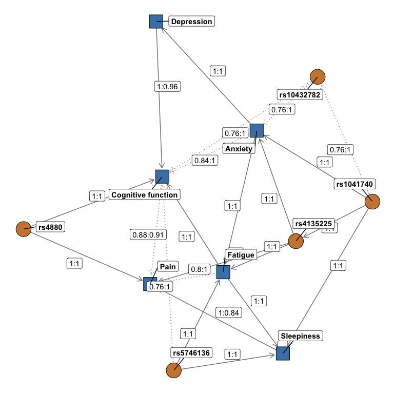

mvNUR Workflow 1: bnlearn
================
Lacey W. Heinsberg


# Copyright

Copyright 2023, University of Pittsburgh. All Rights Reserved.  
License:
[GPL-2](https://www.gnu.org/licenses/old-licenses/gpl-2.0.en.html)

# Overview

This code was adapted from previous work led by Jerry Zhang, Lacey
Heinsberg, and Daniel Weeks:

Zhang JZ, Heinsberg LW, Krishnan M, Hawley NL, Major TJ, Carlson JC,
Harré Hindmarsh J, Watson H, Qasim M, Stamp LK, Dalbeth N, Murphy R, Sun
G, Cheng H, Naseri T, Reupena MS, Kershaw EE, Deka R, McGarvey ST,
Minster RL, Merriman TR, Weeks DE. Multivariate analysis of a missense
variant in CREBRF reveals associations with measures of adiposity in
people of Polynesian ancestries. Genet Epidemiol. 2023
Feb;47(1):105-118. doi: <https://doi.org/10.1002/gepi.22508>. PMID:
36352773; PMCID: PMC9892232.

[GitHub Repository](https://github.com/lwheinsberg/mvCREBRF)

which was created/adapted from:

Scutari M, Howell P, Balding DJ, Mackay I. Multiple Quantitative Trait
Analysis Using Bayesian Networks. Genetics. Genetics; 2014 Apr
11;198(1):129–137. PMID: 25236454 PMCID: PMC4174925 DOI:
<https://doi.org/10.1534/genetics.114.165704>

NOTE: Some of the functions were copied from the bnlearn example at
[Link](http://www.bnlearn.com/research/genetics14/) as allowed under the
Creative Commons Attribution-Share Alike License.

## bnlearn

The R package `bnlearn` is helpful for learning the graphical structure
of Bayesian networks, estimating their parameters, and performing some
useful inference. Installation instructions can be found in the README
file.

# Load Libraries

``` r
library(tidyverse) 
```

    ## Warning: package 'ggplot2' was built under R version 4.2.3

    ## Warning: package 'tidyr' was built under R version 4.2.3

    ## Warning: package 'readr' was built under R version 4.2.3

    ## Warning: package 'dplyr' was built under R version 4.2.3

    ## Warning: package 'stringr' was built under R version 4.2.3

``` r
library(lme4)      
```

    ## Warning: package 'lme4' was built under R version 4.2.3

    ## Warning in check_dep_version(): ABI version mismatch: 
    ## lme4 was built with Matrix ABI version 1
    ## Current Matrix ABI version is 0
    ## Please re-install lme4 from source or restore original 'Matrix' package

``` r
library(bnlearn)  
library(parallel)  
# The 'graph' package is a Bioconductor package
# One of our tutorial test users had trouble installing graph and Rgraphviz packages and had to force install as shown below
#if (!require("BiocManager", quietly = TRUE))
#    install.packages("BiocManager")
#BiocManager::install("graph", force = TRUE)
library(graph)     
library(pander)   
library(ggnetwork)
```

    ## Warning: package 'ggnetwork' was built under R version 4.2.3

``` r
# The 'Rgraphviz' is a Bioconductor packaage
#if (!require("BiocManager", quietly = TRUE))
#    install.packages("BiocManager")
#BiocManager::install("Rgraphviz", force = TRUE)
library(Rgraphviz)  
```

# Read in the synthetic dataset

As detailed in created in
[`00_mvNUR_DataPrep.Rmd`](00_mvNUR_DataPrep.Rmd), the synthetic
phenotype data created for this example .Rmd were adjusted for age and
sex, quantile normalized, and outliers were removed. The quantile
normalized adjusted data set is read in below. Please see `README.Rmd`
for more details about the data set and variables.

``` r
df <- readRDS("data/QuantNorm.rds") ###CUSTOMIZE** (if input file name was changed in 00_ workflow)
```

Read in trait/gene names created there as well.

``` r
load("./data/TraitsGenes.RData", verbose=TRUE) ###CUSTOMIZE** (if input file name was changed in 00_ workflow)
```

    ## Loading objects:
    ##   traits
    ##   genes
    ##   trait_mapping
    ##   custom_labels
    ##   custom_labels2
    ##   df_vertex_table

Alternatively, store trait/gene names manually as shown below.

    # Define the phenotypes of interest
    traits <- c("EMO_tscore", "bdito", "FAT_tscore", "paohcif", "EPSscore", "pain") ###CUSTOMIZE**
    trait_mapping <- c("Anxiety", "Depression", "Fatigue", "Cognitive function", "Sleepiness", "Pain") ###CUSTOMIZE**
    custom_labels <- setNames(trait_mapping, traits)
    # Create expanded custom labels 
    custom_labels2 <- c(custom_labels, setNames(genes, genes))

    # Define variants of interest 
    genes <- c("rs4880", "rs5746136", "rs1041740", "rs10432782", "rs4135225", "rs7522705") ###CUSTOMIZE**

# Bayesian Network estimation

## Load functions

For simplicity, all bnlearn analysis and plotting functions are stored
in see [`bnlearn_functions.R`](bnlearn_functions.R). See that file for
details.

``` r
source("./bnlearn_functions.R")
```

## Apply functions and visualize results

### Data summaries

``` r
# Check dimensions of the synthetic data used here 
dim(df)
```

    ## [1] 763  12

``` r
# Summary of data
summary(df)
```

    ##      rs4880         rs5746136        rs1041740        rs10432782    
    ##  Min.   :0.0000   Min.   :0.0000   Min.   :0.0000   Min.   :0.0000  
    ##  1st Qu.:0.0000   1st Qu.:0.0000   1st Qu.:0.0000   1st Qu.:0.0000  
    ##  Median :1.0000   Median :0.0000   Median :0.0000   Median :0.0000  
    ##  Mean   :0.9725   Mean   :0.4404   Mean   :0.4312   Mean   :0.3028  
    ##  3rd Qu.:1.0000   3rd Qu.:1.0000   3rd Qu.:1.0000   3rd Qu.:1.0000  
    ##  Max.   :2.0000   Max.   :2.0000   Max.   :2.0000   Max.   :2.0000  
    ##    rs4135225        rs7522705        EMO_tscore            bdito          
    ##  Min.   :0.0000   Min.   :0.0000   Min.   :-8.598853   Min.   :-8.142873  
    ##  1st Qu.:0.0000   1st Qu.:0.0000   1st Qu.:-4.745668   1st Qu.:-4.745668  
    ##  Median :1.0000   Median :1.0000   Median :-1.117270   Median :-1.117270  
    ##  Mean   :0.6606   Mean   :0.7339   Mean   :-0.000116   Mean   : 0.001758  
    ##  3rd Qu.:1.0000   3rd Qu.:1.0000   3rd Qu.: 3.607629   3rd Qu.: 3.607629  
    ##  Max.   :2.0000   Max.   :2.0000   Max.   :16.803582   Max.   :17.664804  
    ##    FAT_tscore           paohcif             EPSscore        
    ##  Min.   :-8.598853   Min.   :-8.598853   Min.   :-8.598853  
    ##  1st Qu.:-4.802835   1st Qu.:-4.802835   1st Qu.:-4.876630  
    ##  Median :-1.117270   Median :-1.117270   Median :-0.885189  
    ##  Mean   :-0.000098   Mean   :-0.001958   Mean   : 0.000935  
    ##  3rd Qu.: 3.607629   3rd Qu.: 3.607629   3rd Qu.: 3.607629  
    ##  Max.   :17.664804   Max.   :17.664804   Max.   :17.664804  
    ##       pain          
    ##  Min.   :-8.370863  
    ##  1st Qu.:-4.802835  
    ##  Median :-1.278710  
    ##  Mean   :-0.003648  
    ##  3rd Qu.: 3.468126  
    ##  Max.   :17.664804

``` r
# Correlation structure of data
cor(df[,traits])
```

    ##            EMO_tscore     bdito FAT_tscore   paohcif  EPSscore      pain
    ## EMO_tscore  1.0000000 0.5990665  0.6372831 0.5440664 0.1828286 0.2252510
    ## bdito       0.5990665 1.0000000  0.4163014 0.5059705 0.1838254 0.2103236
    ## FAT_tscore  0.6372831 0.4163014  1.0000000 0.5600751 0.3750783 0.3998224
    ## paohcif     0.5440664 0.5059705  0.5600751 1.0000000 0.1374550 0.2780501
    ## EPSscore    0.1828286 0.1838254  0.3750783 0.1374550 1.0000000 0.4317377
    ## pain        0.2252510 0.2103236  0.3998224 0.2780501 0.4317377 1.0000000

``` r
# View list of traits/SNPs of interest
traits
```

    ## [1] "EMO_tscore" "bdito"      "FAT_tscore" "paohcif"    "EPSscore"  
    ## [6] "pain"

``` r
genes
```

    ## [1] "rs4880"     "rs5746136"  "rs1041740"  "rs10432782" "rs4135225" 
    ## [6] "rs7522705"

### Regular graph

The `run_plot_graph` function calls the `fit.the.model()` and
`xval.the.model()` functions to learn and visualize the Bayesian
networks in the data. This function also customizes node labels and
appearance, and then returns results related to the network analysis.
Note that the following function uses parallel computing which involves
breaking down a complex task into smaller subtasks that can be executed
simultaneously, or in parallel, by multiple processors or computers to
speed up computationally intense calculations.

The `fit.the.model()` function constructs the Bayesian network model by
employing a constrained learning algorithm based on conditional
independence testing, specifically the semi-interleaved HITON-PC method.
In this process, the algorithm identifies “parent-child” relationships
within the network, where nodes represent either phenotypic traits or
genetic variants, and edges signify associations between these nodes.
Notably, traits can have parent nodes that are either genetic variants
or other traits, but they can only serve as parents to other traits,
adhering to the constraint that traits do not act on genetic variants
(since genotypes are constant across an individual’s lifespan).

To enforce this constraint, a “blacklist” is created using the
`tiers2blacklist()` function, preventing arcs from being directed
towards specific nodes. This restriction aims to guide the learning
process by ensuring that known causal relationships are inferred in the
correct direction from genetic variants to traits, while also allowing
for customization to blacklist other traits if needed (e.g., you can
customize this to force/restrict a trait-\>trait relationship).

After the networks are learned, the nodes are categorized into subsets
for visualization, and the network structures are determined by
maximizing the Bayesian Information Criteria (BIC). This approach
facilitates the construction of Bayesian networks that capture
probabilistic relationships between traits and genetic variants, with
the learned structures reflecting potential causal associations.

Further details on the methodology can be found at
<http://www.bnlearn.com/research/genetics14/>.

The `xval.the.model()` function performs model training using n-fold
cross-validation (in the case of this example, 5-fold cross-validation).

During this process, the data set is divided into multiple partitions,
with each partition serving as the test set while the remaining data is
used for training. This process is repeated iteratively to ensure that
all data points are included in the test set at least once.

During each fold of cross-validation, the following steps are performed:

1)  Data Splitting: The dataset is divided into a training set
    (dtraining) and a test set (dtest).
2)  Model Fitting: A Bayesian network model is fitted to the training
    data using the `fit.the.model()` function. This model captures the
    probabilistic relationships between phenotypic traits and genetic
    variants.
3)  Prediction: The model is used to predict the values of phenotypic
    traits on the test set. These predictions are stored in the
    prediction matrix.
4)  Posterior Estimation: Posterior estimates are computed for each
    trait based on the test data. These estimates are stored in the
    posterior matrix.
5)  Correlation Computation: The correlations between the predicted and
    observed values for each trait are calculated, both before (predcor)
    and after (postcor) cross-validation. These correlations provide a
    measure of the model’s predictive performance.
6)  Ridge Regression (Optional): If the ridge parameter is set to true,
    ridge regression is applied to certain nodes of the Bayesian network
    model to improve model performance.

Finally, the function returns various results, including the predicted
values, posterior estimates, observed values, and correlation
coefficients for each trait. Additionally, it provides the learned
models for each fold of cross-validation. This process allows for the
assessment of how well the Bayesian network model generalizes to unseen
data and provides insights into its predictive capabilities.

Here, we will call the above functions and plot the base graph showing
only the directions of association but not the strengths.

``` r
set.seed(6)
results <- run_plot_graph(data = df, k_crossval = 5, k_iterations = 5, alpha = 0.1, ncluster = 8, custom_labels = custom_labels2) 
```

    ## * overall cross-validated correlations:
    ##   > PREDCOR( EMO_tscore ): 0.3450264 
    ##   > POSTCOR( EMO_tscore ): 0.3418341 
    ##   > PREDCOR( bdito ): 0.5794972 
    ##   > POSTCOR( bdito ): 0.1564295 
    ##   > PREDCOR( FAT_tscore ): 0.7323366 
    ##   > POSTCOR( FAT_tscore ): 0.4701054 
    ##   > PREDCOR( paohcif ): 0.6703178 
    ##   > POSTCOR( paohcif ): 0.3077809 
    ##   > PREDCOR( EPSscore ): 0.4307685 
    ##   > POSTCOR( EPSscore ): 0.2783773 
    ##   > PREDCOR( pain ): 0.5086095 
    ##   > POSTCOR( pain ): 0.3444792 
    ## * overall cross-validated correlations:
    ##   > PREDCOR( EMO_tscore ): 0.3668206 
    ##   > POSTCOR( EMO_tscore ): 0.3637307 
    ##   > PREDCOR( bdito ): 0.5824107 
    ##   > POSTCOR( bdito ): 0.1742357 
    ##   > PREDCOR( FAT_tscore ): 0.7340804 
    ##   > POSTCOR( FAT_tscore ): 0.4730514 
    ##   > PREDCOR( paohcif ): 0.6728188 
    ##   > POSTCOR( paohcif ): 0.3142044 
    ##   > PREDCOR( EPSscore ): 0.4332637 
    ##   > POSTCOR( EPSscore ): 0.2818876 
    ##   > PREDCOR( pain ): 0.516585 
    ##   > POSTCOR( pain ): 0.3397383 
    ## * overall cross-validated correlations:
    ##   > PREDCOR( EMO_tscore ): 0.3362601 
    ##   > POSTCOR( EMO_tscore ): 0.3351085 
    ##   > PREDCOR( bdito ): 0.6035443 
    ##   > POSTCOR( bdito ): 0.1941734 
    ##   > PREDCOR( FAT_tscore ): 0.7327031 
    ##   > POSTCOR( FAT_tscore ): 0.4663249 
    ##   > PREDCOR( paohcif ): 0.6564999 
    ##   > POSTCOR( paohcif ): 0.3083567 
    ##   > PREDCOR( EPSscore ): 0.4288491 
    ##   > POSTCOR( EPSscore ): 0.2874386 
    ##   > PREDCOR( pain ): 0.5386219 
    ##   > POSTCOR( pain ): 0.3476662 
    ## * overall cross-validated correlations:
    ##   > PREDCOR( EMO_tscore ): 0.3339423 
    ##   > POSTCOR( EMO_tscore ): 0.3250112 
    ##   > PREDCOR( bdito ): 0.5858688 
    ##   > POSTCOR( bdito ): 0.1595806 
    ##   > PREDCOR( FAT_tscore ): 0.7323323 
    ##   > POSTCOR( FAT_tscore ): 0.471374 
    ##   > PREDCOR( paohcif ): 0.674619 
    ##   > POSTCOR( paohcif ): 0.3208565 
    ##   > PREDCOR( EPSscore ): 0.4576816 
    ##   > POSTCOR( EPSscore ): 0.294876 
    ##   > PREDCOR( pain ): 0.5089625 
    ##   > POSTCOR( pain ): 0.3600803 
    ## * overall cross-validated correlations:
    ##   > PREDCOR( EMO_tscore ): 0.3341934 
    ##   > POSTCOR( EMO_tscore ): 0.3350945 
    ##   > PREDCOR( bdito ): 0.590734 
    ##   > POSTCOR( bdito ): 0.1301288 
    ##   > PREDCOR( FAT_tscore ): 0.7350113 
    ##   > POSTCOR( FAT_tscore ): 0.4736703 
    ##   > PREDCOR( paohcif ): 0.670765 
    ##   > POSTCOR( paohcif ): 0.317689 
    ##   > PREDCOR( EPSscore ): 0.4389516 
    ##   > POSTCOR( EPSscore ): 0.2791155 
    ##   > PREDCOR( pain ): 0.5230457 
    ##   > POSTCOR( pain ): 0.3444847 
    ## EMO_tscore      bdito FAT_tscore    paohcif   EPSscore       pain 
    ##  0.3432486  0.5884110  0.7332928  0.6690041  0.4379029  0.5191649 
    ## EMO_tscore      bdito FAT_tscore    paohcif   EPSscore       pain 
    ##  0.3401558  0.1629096  0.4709052  0.3137775  0.2843390  0.3472897 
    ## threshold:  0.6 
    ## min strength > threshold:  0.76 
    ## strength:  0 0 0 0 0 0 0 0 0 0 0 0 0 0 0 0 0 0 0 0 0 0 0 0 0 0 0 0 0 0 0 0 0 0 0 0 0 0 0 0 0.04 0.04 0.08 0.08 0.08 0.08 0.12 0.12 0.12 0.12 0.12 0.12 0.16 0.16 0.2 0.2 0.32 0.32 0.36 0.36 0.4 0.4 0.6 0.6 0.76 0.76 0.76 0.76 0.76 0.76 0.76 0.76 0.8 0.8 0.84 0.84 0.88 0.88 1 1 1 1 1 1 1 1 1 1 1 1 1 1 1 1 1 1 1 1 1 1 1 1 1 1 1 1 1 1 1 1

<!-- -->

### Labeled high-strength graph

Here we redraw the graph adding strengths/directions to the association
lines.

The strength and directionalities of the edges of the Bayesian networks
are inferred through an iterative process so resulting networks vary a
bit from run to run. As such, representative networks (i.e., averaged)
are plotted.

The code below calls in the function created above to add specific
details on the strength (Es) and direction (Ed) of each edge that
summarize the results across the total number of iterations.

Edge strength is a measure of confidence of that edge while fixing the
rest of the network structure and is defined as the empirical frequency
a specific edge is observed over a set of networks learned from
iterations (i.e., the number of times the edge was present out of the
total number of iterations).

Edge direction represents the probability of the edge’s direction
conditional on the edge’s presence within the network (i.e., the number
of times the edge traveled in a specific direction out of the total
number of iterations in which it was present).

An edge is included in the network graph if its strength is larger than
a significance threshold learned from the iterative samples.

``` r
# Redraw graph adding strengths/directions to association lines using function created above 
# Here, we use a threshold of 0.9 to indicate "strong" associations
# In this case, edges with a strength >0.9 will be solid, while edges with a strength <0.9 will be dashed
set.seed(6)
redraw.graph.labels(
  results$averaged2,
  results$strength2,
  results$averaged,
  results$traits,
  custom.threshold = 0.90
)
```

<!-- -->

Here we can visualize the strengths and directions as a table.

``` r
# Visualize strengths/directions as a table 
results$strength2 %>%
 filter(strength > 0 & direction > 0 & strength > results$threshold) %>%
  arrange(strength) %>% pander()
```

|        from        |         to         | strength | direction |
|:------------------:|:------------------:|:--------:|:---------:|
|     rs1041740      |     rs10432782     |   0.76   |     1     |
|     rs5746136      | Cognitive function |   0.76   |     1     |
|     rs10432782     |      Anxiety       |   0.76   |     1     |
|     rs10432782     | Cognitive function |   0.76   |     1     |
|      Fatigue       |        Pain        |   0.8    |     1     |
|      Anxiety       | Cognitive function |   0.84   |     1     |
|        Pain        | Cognitive function |   0.88   |  0.09091  |
| Cognitive function |        Pain        |   0.88   |  0.9091   |
|      Anxiety       |     Depression     |    1     |     1     |
|      Anxiety       |      Fatigue       |    1     |     1     |
|     Depression     | Cognitive function |    1     |   0.96    |
|      Fatigue       |     Sleepiness     |    1     |     1     |
|      Fatigue       | Cognitive function |    1     |     1     |
|     Sleepiness     |        Pain        |    1     |   0.84    |
|        Pain        |     Sleepiness     |    1     |   0.16    |
|     rs1041740      |      Anxiety       |    1     |     1     |
|     rs1041740      |     Sleepiness     |    1     |     1     |
|     rs1041740      |     rs4135225      |    1     |     1     |
|     rs4135225      |      Anxiety       |    1     |     1     |
|     rs4135225      |      Fatigue       |    1     |     1     |
|     rs4135225      |        Pain        |    1     |     1     |
|       rs4880       |        Pain        |    1     |     1     |
|       rs4880       | Cognitive function |    1     |     1     |
|     rs5746136      |      Fatigue       |    1     |     1     |
|     rs5746136      |     Sleepiness     |    1     |     1     |
| Cognitive function |     Depression     |    1     |   0.04    |

### ggnetwork graph

Finally, we redraw the graph again. This time, we are changing the
colors, line types, and using `ggrepel` so that node and edge labels do
not overlap.

``` r
# Redraw graph in black and white using ggnetwork through the function created above 
set.seed(6)
redraw.label.ggnet(results$averaged2,
                   results$strength2,
                   results$averaged,
                   results$traits, 
                   df_vertex_table = df_vertex_table)
```

<!-- -->

Interpretation: Given the complexity of this plot, let’s focus on
breaking apart a few results for a single variant, rs5746136. In this
example figure, we see direct associations (solid arrows pointing away
from the variant) between the rs5746136 with sleepiness and fatigue, and
a weaker direct association (dashed line pointing away from the variant)
with cognitive function. We also observe indirect associations between
rs5746136 and pain through sleepiness, which can be interpreted as pain
being conditionally independent of rs5746136 given the presence of
sleepiness.

In this figure, the strengths (Es) and directions (Ed) of the
relationships are also depicted along the edges (Es:Ed). As described
above, the strength is a measure of confidence of that edge while fixing
the rest of the network structure and is defined as the empirical
frequency a specific edge is observed over a set of networks learned
from iterations (i.e., the number of times the edge was present out of
the total number of iterations). Edge direction represents the
probability of the edge’s direction conditional on the edge’s presence
within the network (i.e., the number of times the edge traveled in a
specific direction out of the total number of iterations in which it was
present). So in the figure, we see an association between rs5746136 and
fatigue with Es:Ed values of 1:1. This means that the edge was present
in 100% of all iterations and the relationship traveled from the
rs5746136 variant (“parent”) to fatigue (“child”) 100% of the time. Note
that in our “blacklist” code above, we specified that all variants could
only be a “parent” and not a “child” – so directions of 1 on arrows
travelling from variants to symptoms are expected. Note that, as the
arrow traveling from cognitive function to pain illustrates, edge
strength and direction may be less than 1. With Es:Ed values of
0.88:0.91, this relationship was observed in 88% of iterations but
traveled in the shown direction in only 91% of realizations. Finally,
note that in the figure edges with a strength \>0.9 are solid, while
edges with a strength \<0.9 are dashed.

# Conclusion

And with that, we conclude our `bnlearn` tutorial! We hope that this
code is documented in enough detail so that you can easily adapt it for
your own projects, but feel free to reach out with any questions! Please
see [`00_mvNUR_mvBIMBAM.Rmd`](00_mvNUR_mvBIMBAM.Rmd) (web version:
[`00_mvNUR_mvBIMBAM.md`](00_mvNUR_mvBIMBAM.md)) for the mvBIMBAM
tutorial!

# Session information

``` r
sessioninfo::session_info()
```

    ## ─ Session info ───────────────────────────────────────────────────────────────
    ##  setting  value
    ##  version  R version 4.2.1 (2022-06-23)
    ##  os       macOS 14.3.1
    ##  system   aarch64, darwin20
    ##  ui       X11
    ##  language (EN)
    ##  collate  en_US.UTF-8
    ##  ctype    en_US.UTF-8
    ##  tz       America/Toronto
    ##  date     2024-07-22
    ##  pandoc   3.1.1 @ /Applications/RStudio.app/Contents/Resources/app/quarto/bin/tools/ (via rmarkdown)
    ## 
    ## ─ Packages ───────────────────────────────────────────────────────────────────
    ##  package      * version  date (UTC) lib source
    ##  BiocGenerics * 0.44.0   2022-11-07 [1] Bioconductor
    ##  bnlearn      * 4.8.3    2023-04-29 [1] CRAN (R 4.2.0)
    ##  boot           1.3-30   2024-02-26 [2] CRAN (R 4.2.3)
    ##  cli            3.6.2    2023-12-11 [1] CRAN (R 4.2.3)
    ##  colorspace     2.1-0    2023-01-23 [1] CRAN (R 4.2.0)
    ##  digest         0.6.35   2024-03-11 [1] CRAN (R 4.2.3)
    ##  dplyr        * 1.1.4    2023-11-17 [1] CRAN (R 4.2.3)
    ##  evaluate       0.23     2023-11-01 [1] CRAN (R 4.2.0)
    ##  fansi          1.0.6    2023-12-08 [1] CRAN (R 4.2.3)
    ##  farver         2.1.2    2024-05-13 [1] CRAN (R 4.2.3)
    ##  fastmap        1.2.0    2024-05-15 [1] CRAN (R 4.2.3)
    ##  forcats      * 1.0.0    2023-01-29 [1] CRAN (R 4.2.0)
    ##  fuzzyjoin      0.1.6    2020-05-15 [1] CRAN (R 4.2.0)
    ##  generics       0.1.3    2022-07-05 [1] CRAN (R 4.2.0)
    ##  ggnetwork    * 0.5.13   2024-02-14 [1] CRAN (R 4.2.3)
    ##  ggplot2      * 3.5.1    2024-04-23 [1] CRAN (R 4.2.3)
    ##  ggrepel        0.9.5    2024-01-10 [1] CRAN (R 4.2.3)
    ##  glue           1.7.0    2024-01-09 [1] CRAN (R 4.2.3)
    ##  graph        * 1.76.0   2022-11-07 [1] Bioconductor
    ##  gtable         0.3.5    2024-04-22 [1] CRAN (R 4.2.3)
    ##  highr          0.10     2022-12-22 [1] CRAN (R 4.2.0)
    ##  hms            1.1.3    2023-03-21 [1] CRAN (R 4.2.0)
    ##  htmltools      0.5.8.1  2024-04-04 [1] CRAN (R 4.2.3)
    ##  igraph         2.0.3    2024-03-13 [1] CRAN (R 4.2.3)
    ##  knitr        * 1.46     2024-04-06 [1] CRAN (R 4.2.1)
    ##  labeling       0.4.3    2023-08-29 [1] CRAN (R 4.2.0)
    ##  lattice        0.22-6   2024-03-20 [2] CRAN (R 4.2.3)
    ##  lifecycle      1.0.4    2023-11-07 [1] CRAN (R 4.2.3)
    ##  lme4         * 1.1-35.3 2024-04-16 [1] CRAN (R 4.2.3)
    ##  lubridate    * 1.9.3    2023-09-27 [1] CRAN (R 4.2.0)
    ##  magrittr       2.0.3    2022-03-30 [1] CRAN (R 4.2.0)
    ##  MASS           7.3-58.3 2023-03-07 [2] CRAN (R 4.2.0)
    ##  Matrix       * 1.5-4    2023-04-04 [1] CRAN (R 4.2.0)
    ##  minqa          1.2.6    2023-09-11 [1] CRAN (R 4.2.0)
    ##  munsell        0.5.1    2024-04-01 [1] CRAN (R 4.2.3)
    ##  nlme           3.1-164  2023-11-27 [2] CRAN (R 4.2.3)
    ##  nloptr         2.0.3    2022-05-26 [1] CRAN (R 4.2.0)
    ##  pander       * 0.6.5    2022-03-18 [1] CRAN (R 4.2.0)
    ##  pillar         1.9.0    2023-03-22 [1] CRAN (R 4.2.0)
    ##  pkgconfig      2.0.3    2019-09-22 [1] CRAN (R 4.2.0)
    ##  purrr        * 1.0.2    2023-08-10 [1] CRAN (R 4.2.0)
    ##  R6             2.5.1    2021-08-19 [1] CRAN (R 4.2.0)
    ##  Rcpp           1.0.12   2024-01-09 [1] CRAN (R 4.2.3)
    ##  readr        * 2.1.5    2024-01-10 [1] CRAN (R 4.2.3)
    ##  Rgraphviz    * 2.42.0   2022-11-07 [1] Bioconductor
    ##  rlang          1.1.3    2024-01-10 [1] CRAN (R 4.2.3)
    ##  rmarkdown      2.27     2024-05-17 [1] CRAN (R 4.2.3)
    ##  rstudioapi     0.16.0   2024-03-24 [1] CRAN (R 4.2.3)
    ##  scales         1.3.0    2023-11-28 [1] CRAN (R 4.2.3)
    ##  sessioninfo    1.2.2    2021-12-06 [1] CRAN (R 4.2.0)
    ##  stringi        1.8.4    2024-05-06 [1] CRAN (R 4.2.3)
    ##  stringr      * 1.5.1    2023-11-14 [1] CRAN (R 4.2.3)
    ##  tibble       * 3.2.1    2023-03-20 [1] CRAN (R 4.2.0)
    ##  tidyr        * 1.3.1    2024-01-24 [1] CRAN (R 4.2.3)
    ##  tidyselect     1.2.1    2024-03-11 [1] CRAN (R 4.2.3)
    ##  tidyverse    * 2.0.0    2023-02-22 [1] CRAN (R 4.2.0)
    ##  timechange     0.3.0    2024-01-18 [1] CRAN (R 4.2.3)
    ##  tzdb           0.4.0    2023-05-12 [1] CRAN (R 4.2.0)
    ##  utf8           1.2.4    2023-10-22 [1] CRAN (R 4.2.0)
    ##  vctrs          0.6.5    2023-12-01 [1] CRAN (R 4.2.3)
    ##  withr          3.0.0    2024-01-16 [1] CRAN (R 4.2.3)
    ##  xfun           0.44     2024-05-15 [1] CRAN (R 4.2.3)
    ##  yaml           2.3.8    2023-12-11 [1] CRAN (R 4.2.3)
    ## 
    ##  [1] /Users/law145/Library/R/arm64/4.2/library
    ##  [2] /Library/Frameworks/R.framework/Versions/4.2-arm64/Resources/library
    ## 
    ## ──────────────────────────────────────────────────────────────────────────────
